<p align="center">
    <a href='https://docs.oracle.com/en/java/javase/8'></a>
    <a href='https://docs.spring.io/spring-boot/docs/2.6.2-SNAPSHOT/reference/html'></a>
    <a href='https://staging-cn.vuejs.org'></a><br/>
    <a href='#'></a>
    <a href='#'></a>
    <a href='#'></a>
    <a href='#'></a>
</p>

# 图书管理系统

+ 此项目是一个**Java J2SE（Java 2 Platform, Standard Edition）开发体系**[CMS(内容管理系统)](https://baike.baidu.com/item/CMS/315935?fr=aladdin)JAVASE项目,前端为GUI,主要使用以及应用到的技术如下：


#### 项目描述

1. Jdk和Jre和Jvm在项目中的应用
2. Eclipse搭建Tomcat服务器以及Jdk8的应用
3. 通过properties文件配置数据库驱动用户名密码url链接
4. 常量以及变量的应用
5. 四类八种数据类型的应用
6. 数据类型的隐式以及显示转换
7. 流程控制语句的运用
8. 数组的运用
9. 方法的定义及调用
10. 对象的创建和使用
11. 垃圾回收机制的使用
12. 引用数据类型的转换上溯造型下溯造型
13. 异常处理以及自定义异常
14. 方法调用堆栈
15. 包装类以及字符串类Math类日期类的使用
16. 集合的使用
17. 文件与流的使用
18. 多线程的使用
19. JDBC与Java数据库编程的使用
20. DDL、DML、DQL在项目中的应用
21. Oracle数据库迁移至Mysql数据库
22. Java Swing技术的应用


#### 开发环境

+ Windows


#### 配置环境

| 程序           | 版本        | 说明                       |
|--------------|-----------|--------------------------|
| Jdk          | 1.8.0 161 | Java 开发工具包               |
| Mysql        | 5.5.27    | 关系型数据库                   |
| 或者 Oracle    | 11.2.0.1.0    | 关系型数据库                   |

#### 开发工具

| 工具                       | 版本            | 说明                      |
|--------------------------|---------------|-------------------------|
| Eclipse IDE              | 4.11.0(2022.12)| 前后端开发IDE                |
| Git                      | 2.24.1        | 代码托管平台                  |
| Navicat                  | 12       | 数据库连接工具                 |
| PL/SQL                  | 11.2.0.1.0       | 数据库连接工具                 |

####  编码规范

- 规范方式：严格遵守阿里编码规约。
- 命名统一：简介最大程度上达到了见名知意。
- 分包明确：层级分明可快速定位到代码位置。
- 注释完整：描述性高大量减少了开发人员的代码阅读工作量。
- 工具规范：使用统一jar包避免出现内容冲突。
- 代码整洁：可读性、维护性高。

#### 包的作用

| 包              | 作用                          |
| :-------------- | ----------------------------- |
| config.images   | 存放图片                      |
| config.dbconfig | 存放数据库配置文件            |
| lib             | 存放程序驱动                  |
| entity          | 实体类                        |
| util            | 公共类                        |
| view            | 视图类                        |
| factory         | 工厂类，专门生产各类dao的实例 |
| ifac            | 接口类                        |
| impl            | 接口实现类                    |
| test            | 测试类                        |

#### 项目运行

1. 保证已安装jdk1.8的环境
2. Eclipse与jdk要配置好
3. navicat导入mylibary_all.sql运行生成对应的数据表前提是你安装好对应的mysql以及navicat
4. 利用Eclipse打开测试类运行此项目

#### 技术选型：
```
数据库：Oralce11G
JDBC工具：DBUtils
层与层之间解耦合：工厂设计模式
数据展示控件：JTable
访问数据库的查询方法封装使用技术：泛型，反射机制
```

#### 总体架构：

MVC设计模式：
1. **M(Model) 模型:** 应⽤程序的核⼼功能，管理这个模块中⽤的数据和值（bean,dao） 数据访问层：Dao
2. **V(View )视图:** 视图提供模型的展示，管理模型如何显示给⽤户，它是应⽤程序的外观；（jsp/html）
3. **C(Controller)控制器:** 对⽤户的输⼊做出反应，管理⽤户和视图的交互，是连接模型和视图的枢纽。（servlet/service）
> 在此项目中用的工厂模式 其实 ifac 包就相当于service
4. entity文件夹 实体类属于公共层 不属于mvc任何层,也可存放于domain文件夹
4. 本项目中view层调用dao层，dao层调用数据库，其中 dao层中 ifac为接口 impl为接口的实现 通过factory解耦合 并实现连接

#### 模块划分

##### 用户前台模块部分：
```
1. 注册信息
2. 用户登陆
3. 查看所有图书信息
4. 查看热门图书信息
5. 查看可借图书信息
6. 查看已借图书信息(不可借)
7. 查看本人所有借书记录
8. 查看本人未归还图书记录
9. 查看本人已归还图书记录(已还借书记录)
10. 借书
11. 还书
```
##### 管理员后台模块部分：
```
1. 用户登陆
2. 查看所有图书信息
3. 查看热门图书信息
4. 查看可借图书信息
5. 查看已借图书信息(不可借)
6. 查看指定 图书名 的图书信息
7. 添加图书
8. 查看 所有用户的借阅记录
9. 查看 所有用户的未还记录
10. 查看 所用用户的已还记录
11. 查看 当前用户的借阅记录
12. 查看 当前用户的未还记录
13. 查看 当前用户的已还记录
14. 查看 指定用户的借阅记录
15. 查看 指定用户的未还记录
16. 查看 指定用户的已还记录
17. 查询所有用户
18. 查询指定用户
```
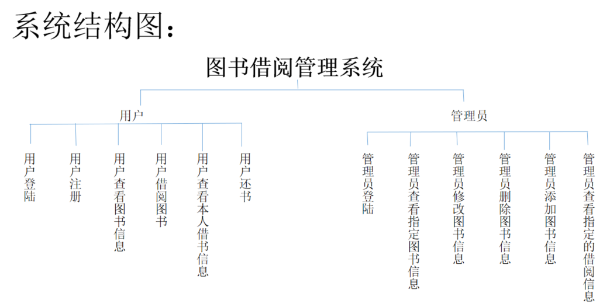

#### 主要功能

1. 普通用户注册，主要功能为图书查询和借阅记录查询两大模块。

+ 1. 查询所有图书
  2. 借书
  3. 还书
  4. 查询自己的所有借书记录
  5. 查询自己所有未还的图书
  6. 查询自己的已还的借书记录

2. 管理员用户注释，主要功能也是图书查询和借阅记录查询两大模块。
   + 1. 查询所有的图书
     2. 借书
     3. 还书
     4. 查询所有用户或指定用户的借书记录
     5. 查询所有用户或指定用户的所有未还的图书
     6. 查询所有用户或指定用户的已还的借书记录
     7. 添加图书
     8. 删除图书
     9. 修改图书


#### 数据库设计

##### myLibary_book表

| 列名       | 数据类型 | 可否为空 | 说明                           |
| :--------- | -------- | -------- | ------------------------------ |
| book_id    | int      | not null | 书籍编号，自增长               |
| book_name  | varchar  | not null | 书籍名称                       |
| book_count | int      | not null | 借出次数                       |
| status     | int      | not null | 书籍状态（0，已借出，1，可借） |


##### myLibary_user表
|  列名	 |  数据类型  |  可否为空  |  说明  |
| :----- | -------- | --------- | ------ |
|user_id |	int|	not null|	用户编号，自增长|
|user_name|	varchar|	not null|	用户名，唯一|
|user_password|	varchar	|not null|	用户密码|
|user_type	|int| 1not null |	用户类型，1，普通用户，2，管理员|

#### myLibary_record表

> 存放所有的借阅记录的表

|  列名	|  数据类型  |  可否为空  |	 说明  |
| :----  | --------- | --------- | ------ |
| record_id	| int | not null	| 记录编号，自增长|
| user_id	| int | not null	| 借书人的编号，外键|
| book_id	| int  | not null	| 书籍编号，外键|
| lend_time	| date | not null	| 借出时间|
| return_time | date || 归还时间 |

#### 业务功能简介

1. 用户登录


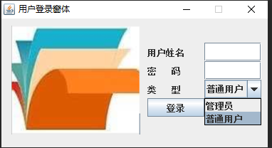

2. 用户注册

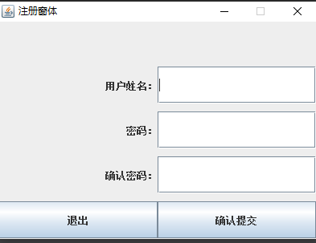

3. 所有图书查询功能

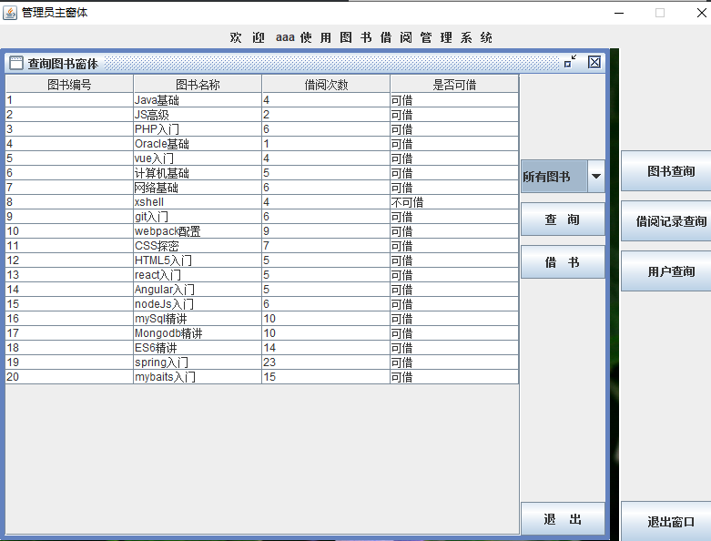

4. 热门图书查询

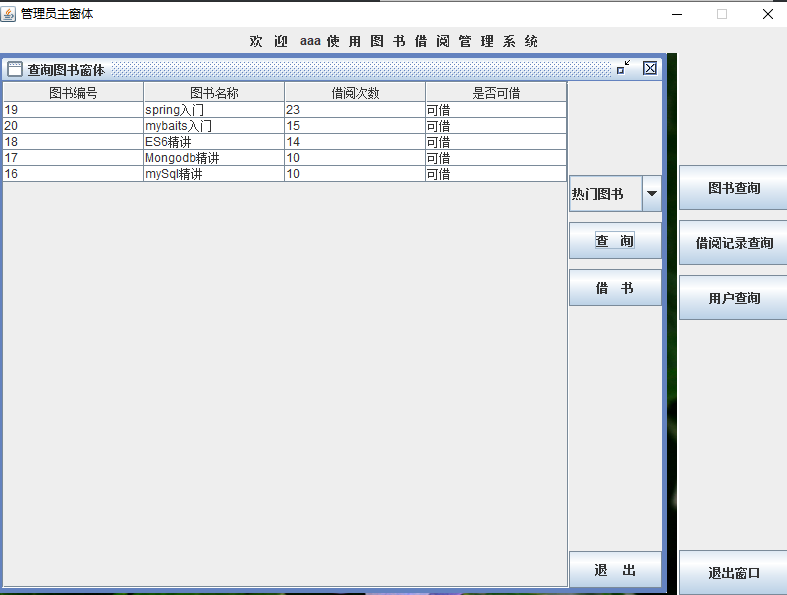

5. 可借图书查询

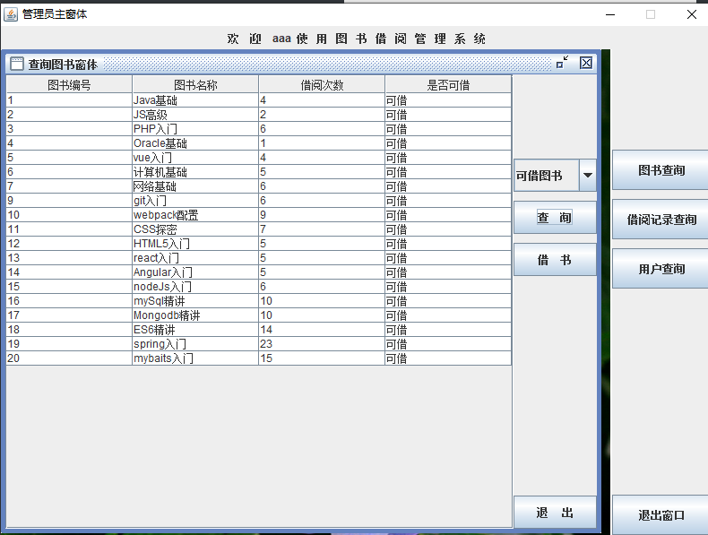

6. 不可借图书查询

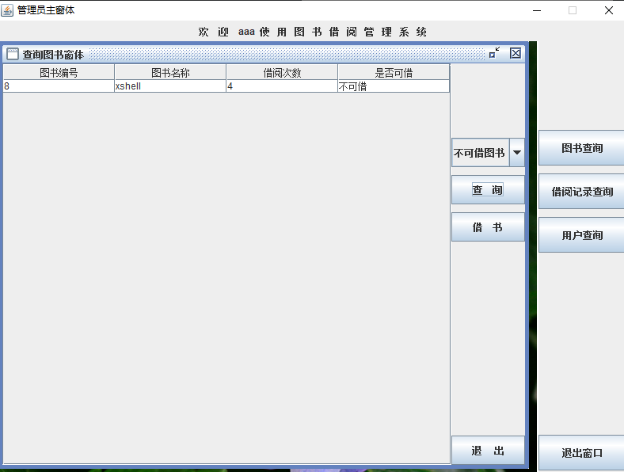

7. 指定图书查询

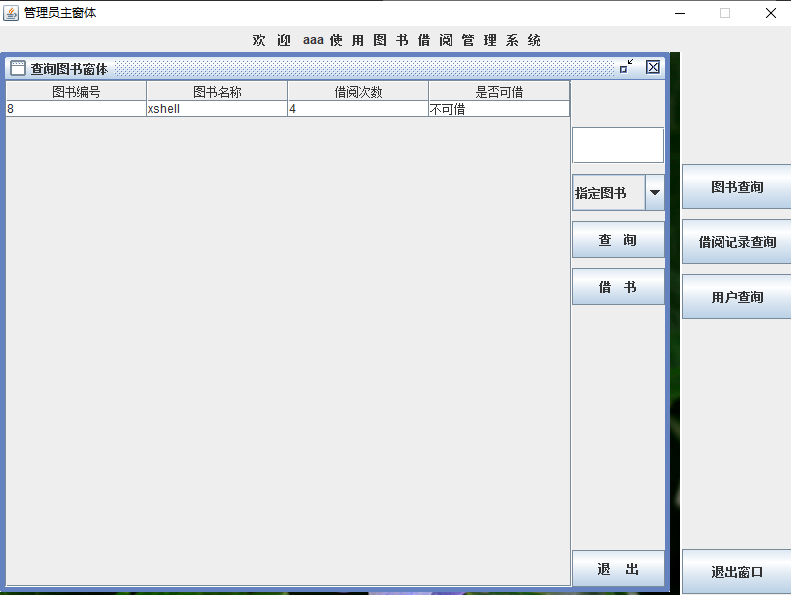

8. 添加图书

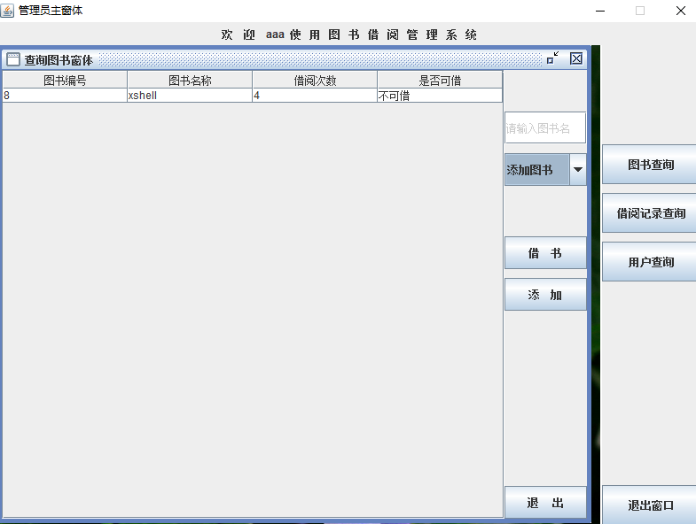

9. 借阅记录查询 当前用户指定用户所有用户

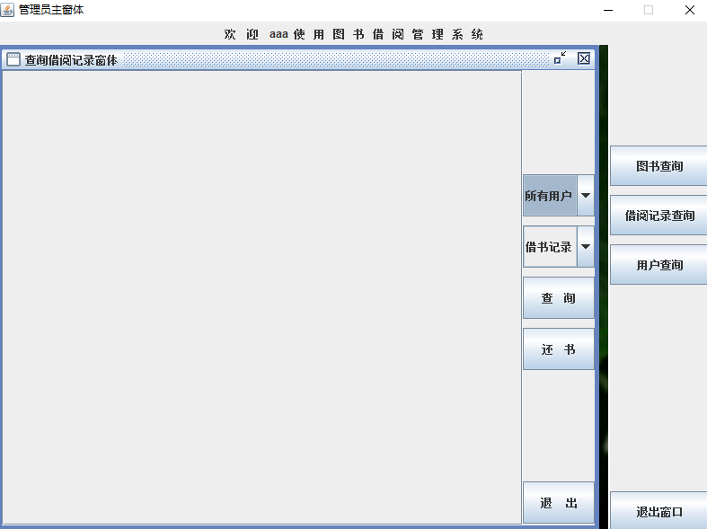

10. 指定用户查询所有用户查询

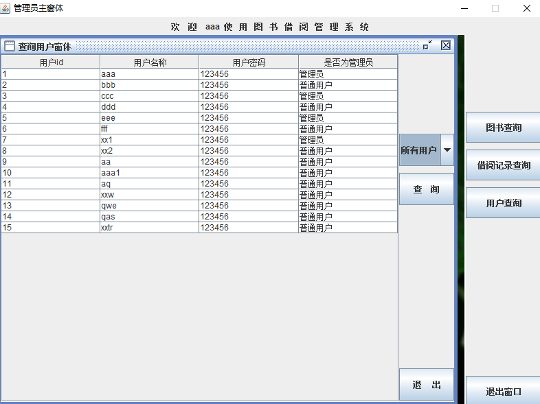

#### 参考博客

1. [JavaWeb中的MVC模式（有案例）](https://blog.csdn.net/weixin_45819587/article/details/120564732)
1. [Java语言使用JDBC连接Mysql数据库的详细步骤，以及详细解释（一）](https://blog.csdn.net/weixin_44912627/article/details/109464979)
1. [各个数据库中，查询前n条记录的方法](https://blog.csdn.net/Schaffer_W/article/details/117062045)
1. [MySQL序列的使用](https://www.yiibai.com/mysql/mysql-using-sequences.html)
1. [如何在MySQL中创建和使用序列？](https://www.nhooo.com/note/qa06il.html)
1. [mysql与oracle的区别_MySQL](https://www.php.cn/mysql-tutorials-68362.html)
1. [**Oracle与MySQL的几点区别**](https://blog.51cto.com/u_15067234/4183964)
1. [[MySQL与Oracle之间的区别](https://www.cnblogs.com/KYKY22/p/5755105.html)]
1. [mysql与oracle区别](https://blog.csdn.net/qq_37480021/article/details/80703081)
1. [Oracle转MySQL日记（三） ---关于Oracle序列(Sequence)的转化](https://blog.csdn.net/zjfhhc/article/details/105935131)
1. [Navicat设置自动递增的基本步骤](https://www.jianshu.com/p/6ede8ff21e4c)
1. [Java Swing 隐藏JTable的某一列](https://blog.csdn.net/weixin_42089228/article/details/107901907)
1. [Java Swing 只关闭当前窗体](https://zhuanlan.zhihu.com/p/150829207)
1. [Java代码中如何判断一个字符串中是否包含特殊字符呢？](https://www.cnblogs.com/javalove2022/p/16689963.html)
1. [如何给combobox设定一个默认值？](https://blog.csdn.net/weixin_34124651/article/details/85488261)
1. [JTextField显示提示信息](https://blog.csdn.net/qq_43319748/article/details/108636961)
1. [**Eclipse 快捷键返回值Alt+shift+L和Ctrl+1**](https://blog.51cto.com/u_14879850/5867019)
1. [gitee的markdown文件图片显示不出来](https://www.cnblogs.com/hi3254014978/p/14150052.html)

#### 技术应用

 + 1. Jdk和Jre和Jvm在项目中的应用

 + 2. Eclipse搭建Tomcat服务器以及Jdk8的应用

 + 3. 通过properties文件配置数据库驱动用户名密码url链接

 + 4. 变量和运算符
	+ Java程序运行原理
	
	+ 注释的使用
	
	+ 空白符和行号
	
   + 类和主方法
   
   + 标识符、关键字和保留字
   
   + 常量
        - 整型字面常量，如：123，067，0X1D，123L
	     - 浮点数字面常量，如：123.4，.18，1.8e1，1.2D，1.2F
	     - 布尔型字面常量，如：true，false
	     - 字符字面常量，如：’a’，’8’，‘\n’，‘\u123f’
	     - 字符串字面常量，如：“a”，“hello”
	     - 引用类型字面常量，：null
	     
	+ 数据类型
		- 基本数据类型：4类8种基本数据类型
			- 数值型
				- 整数类型 — byte、short、int默认、long
				- 浮点数类型 — float、double
			- 字符型 char
			- 布尔型 boolean
		- 引用数据类型
			- 类 class
			- 接口 interface
			- 数组 array
		
	+ 变量
	
	+ 数据类型的转换
		- 自动类型转换（隐式类型转换）
			* 有多种类型的数据混合运算时，系统首先自动的将所有数据转换成容量最大的那一种数据类型，然后进行计算
			* 自动转换规则
				+ boolean类型不可以转换为其他的数据类型
				+ 整型、字符型、浮点型的数据在混合运算中相互转换，转换时遵守以下原则(byte/short/char) --> int --> long --> float ---> double
				+ byte、short、char之间不会相互转换，他们三者在计算时首先会转换为int类型
			
		- 强制类型转换（显示类型转换）
			* 容量大的数据类型转换为容量小的数据类型时，需要使用强制类型转换，其格式如下：变量 = (目标类型) 值 例如： byte  a;int b;a = (byte) b;
			* 在强制类型转换过程中，源类型的值可能大于目标类型，因此可能造成精度降低或溢出，使用时需注意
		
	+ 运算符
		+ 算术运算符： +、﹣、*、/、%、++、 --
		
		+ 赋值运算符：=、+=、﹣=、*=、/=、%=
		
		+ 关系运算符：>、<、>=、 <=、= =、!=、instanceof
		
		+ 逻辑运算符：!、&&、||
		
		+ 移位运算符： &、|、^ 、 ~、>>、<<、>>>
		
		+ 条件运算符： ?：
		
		+ 运算符的优先级
		
		  - 按操作数多少划分
		  	* 一元操作符 > 二元操作符 > 三元操作符
		  - 按运算类型划分
		  	* 算术运算符 > 关系运算符 > 逻辑运算符 > 赋值运算符
		  - 尽量多的使用括号
		  	* 括号优先级别最高
		
	+ 表达式
	
	     - 表达式的值和类型
             * 对表达式中操作数进行运算得到的结果称为表达式的值
             * 表达式值的数据类型即为表达式的类型
	     
	     - 表达式的运算顺序
	     	* 应按照运算符的优先级从高到低的顺序进行
	     	* 优先级相同的运算符按照事先约定的结合方向进行
	
+ 5. 流程控制语句
	- 条件语句
		* if语句
		* switch语句
	- 循环语句
		* while循环
		* do-while循环
		* for循环
		* 死循环
		* 嵌套循环
		* 循环的中断

+ 6. 数组
    - 一维数组	
        * 数组的定义和创建
        * 数组的内存模型
        * 数组的初始化
        * 数组元素的访问
        * 数组的属性
        * 数组的异常
    - 多维数组	
        * 多维数组的创建
        * 多维数组的初始化
        * 多维数组的内存模型
    - 数组的操作
        * 多维数组的遍历
        * 数组的复制和排序

+ 7. 方法定义及调用
    - 方法的定义
        * 什么是方法
        
          * 方法是完成某个功能的一组语句，通常将常用的功能写成一个
        
        * 方法的定义
        
          * [访问控制符] [修饰符] 返回值类型 方法名(参数类型 形式参数,参数类型 形式参数,…)
            {
                方法体
            }
          * 修饰符：public 、static 被称为修饰符（后续会详细讲解它们）；
          * 返回值类型：用来说明该方法运算结果的类型。如果返回其他类型，编译就可能出错；
          * 方法名：它作为调用时引用方法的标识；
          * 参数列表：方法的参数个数可以是0个到多个，每个参数前面要声明参数的数据类型；每个参数要用逗号分开。也可以一个参数都没有。
          * 方法体：它是一个语句块，执行特定的功能操作。对于有返回值类型的方法，方法体当中最后一个语句是return关键字，它的作用是把方法的执行（运算）结果返回到方法外部。		
          * return  表达式：这里，进一步分析，return后面的表达式就是方法的返回值。需要注意表达式的类型，必须与方法头中声明的“返回类型”相匹配。
        
        * 方法的分类
        
          - 根据参数个数： 
        
            * 无参方法
            * 有参方法

          - 根据返回值类型:
            	* 有返回值的方法：
                    + 基本数据类型
                    + 引用数据类型
            	* 无返回值的方法
                    + void
    - 方法的调用
        * 无参方法的调用
        * 有参方法的调用
        * 使用方法时的注意问题
    - 方法的重载
    	- 方法的重载就是在同一个类中允许同时存在一个以上同名的方法
    	- 方法重载的规则
            + 方法名称相同
            + 方法的参数必须不同
            + 参数个数不同   或   参数类型不同
            + 方法的返回值类型可以相同，也可以不同

+ 8. 面向对象基础
	- 面向对象编程思想（OOP：Object-Oriented Programming ）
    - 类的定义
        * 什么是类
        * 类的格式
        * 类的成员
    - 对象的创建和使用
        * 什么是对象
        * 创建对象
        * 构造器（构造方法/构造器，Constructor）
            - 具有与类相同的名称
            - 不含返回值类型
            - 不能在方法中用return语句返回一个值
            - 一般访问权限为public
            - 在一个类中，具有上述特征的方法就是构造器。
            		+ 构造器的作用
                    - 完成对象的创建，即完成对象的实例化
                    - 一般使用构造器来完成对成员变量的初始化

        * 使用对象
        	- 在其他类中或main方法中，若想访问对象的属性或是方法必须先实例化这个类，然后通过对象名（引用）和点操作符来完成：	对象名. 属性名（）；对象名. 方法名（）；				- 如果在类内的方法中，访问本类的属性和方法就可以直接访问了。

        * 匿名对象
        	- 创建完对象，在调用该对象的方法时，也可以不定义对象的句柄，而直接调用这个对象的方法。这样的对象叫匿名对象
        * 变量的作用域
    - this关键字
    	+ 代表对象自身的引用
            - 一个引用
            - 指向调用该方法的当前对象
		+ 通常在类的方法定义中使用

    - 垃圾回收机制(Garbage First)
    	+ Java的垃圾回收机制是自动的，它保证程序健壮的主要手段，避免了由于程序员忘记回收内存而引起的内存泄漏，同时也避免了回收内存带来的代码繁琐。
		+ 垃圾回收机制实际上是JVM内部运行的一个优先级比较低的后台线程，这种多线程的模式使得java 具有更好的性能，完全不用程序员参与。
		+ 垃圾回收机制仅仅作用于堆内存，于栈内存无关。
		+ 对于程序员来说，对象何时变成垃圾呢？
		~~~
            对象的引用被赋值为null； Person p = new Person( );   p = null;
            一次性使用的匿名对象;	new Person( ).sayHello( );
            超出生命周期的；如：
                  for( int I = 0; i< 100; i++){
                    Person p = new Person( );
                }	
		~~~
+ 9. 面向对象高级特性

	- 类的继承
        * 理解继承的含义
        * 继承的语法和规则
        * 子类实例化的过程
        * super关键字和this关键字
	- Java包的概念	
		* 包的概念及应用
        * Java类库中的常用包
        * import导入包中的类
        * 访问权限修饰符	封装
        * 访问权限修饰符
	- 方法的覆盖
	- 引用数据类型的转换
        * 上溯造型
        * 下溯造型
        * instanceof运算符
	- 多态

+ 10. 异常处理

	- 异常简介
		* 异常的定义
	- 异常类的继承关系
        * 异常的继承树
		* 异常类型
	- 异常处理机制
		* 异常的处理过程
		* try..catch语句
		* finally语句
		* throws关键字
		* throw语句
	- 方法调用的堆栈
	- 自定义异常

+ 11. 工具类
	- Java API	Java API简介
	- Object	Object介绍及方法
	- 包装类	包装类简介
        * 基本数据类型转换为包装类
        * 字符串转换为包装类
        * 包装类转换为基本数据类型
        * 包装类转换为字符串
        * 字符串转换为基本数据类型
        * 自动装箱和自动拆箱
	- 字符串类
        * String对象的创建
        * String中常用的方法
        * StringBuffer对象的创建
        * StringBuffer中常用的方法
        * StringBuilder对象的创建
        * StringBuilder中常用的方法
        * String与StringBuffer的比较
        * StringBuffer与Stringbuilder的比较
	- Math类
        * Math中常用的方法
	- 日期类
        * Date类
        * Date类中常用方法
        * Calendar类
        * Calendar类常用属性
        * SimpleDateFormat类的使用

+ 12. 集合
		-Java中的集合类
		* 集合概述
		* Java中集合框架层次结构
		-Collection接口
        * Collection接口
        * Set接口
        * Set接口的实现类
        * List接口
        * List接口的实现类
        * Iterator接口
		-Collections类
		* Collections类
		-Map接口
		* Map接口
		* Map接口的实现类
		* HashMap与TreeMap的比较
		* HashMap与HashTable的比较
		-集合中的异常
		* 使用集合时常见的异常
		-泛型的使用
		* 集合中泛型的使用

+ 13. 文件与流
		-文件管理
		* 文件管理概述
		* File类
		-流的概念及API
		* 流的概念
		* 字节流中的层次结构图
		* 字节流中的主要方法
		* 字符流中的层次结构图
		* 字符流中的主要方法
		-节点流与处理流的使用
		* 什么是节点流
		* 节点流的方法
		* 文件的访问
		* 什么是处理流
		* 常见的处理流类
		-对象的序列化
		* 对象序列化概述
		* 支持序列化的接口和类
		* 对象序列化的条件
		* transient
+ 14. 多线程编程
		-多线程简介
		* 进程/线程区别
		-多线程实现的两种方式
		* 继承
		* 接口
		* 两种实现方式比较
		-线程的属性和控制
		* 线程状态及其生命周期
		* 线程类中的主要方法
		* 线程优先级
		* 线程休眠和线程中断
		* 线程的高级操作
		-多线程的同步/通信问题
		* 线程同步
		* 锁
		* 死锁
+ 15. 网络编程
	- 网络基础知识
		* 网络基础知识
		* IP地址和端口号
		* TCP与UDP
	- Socket编程
		* Socket原理
		* 基于TCP的Socket编程
		* 基于多线程的Socket编程
+ 16. JDBC与Java数据库编程
	- JDBC概述
		* 什么是JDBC
		* JDBC实现的功能
		* JDBC的体系结构
		* JDBC特点
		* JDBC核心接口与类
	- 创建JDBC应用
		* 创建JDBC应用程序的步骤
		* 数据库驱动程序
		* 加载 JDBC 驱动程序
		* 建立与数据库的连接
		* 获得 Statement 对象
		* 执行 SQL 语句
		* 操作结果集对象
		* SQL类型对应 Java 数据类型
		* ResultSet接口的getXxx 方法
		* 关闭操作对象及连接
		* JDBC日期时间处理
	- PreparedStatement
		* PreparedStatement接口
		* PreparedStatement接口setXxx 方法
		* PreparedStatement接口优点：  
+ 17. Java8新特性
+ 18. DDL、DML、DQL在项目中的应用
	- 限制数据和对数据排序
	- 单行函数
	- 多表连接
	- 分组函数
	- 子查询
	- 集合运算
	- 高级子查询
	- 层次查询
	- 数据操作与事务控制
	- Oracle数据库网络连接
	- 创建和维护表
	- 约束
	- 视图
	- 序列、索引、同义词
	- 用户、权限和角色
+ 19. Oracle数据库迁移至Mysql数据库
+ 20. Java Swing技术的应用