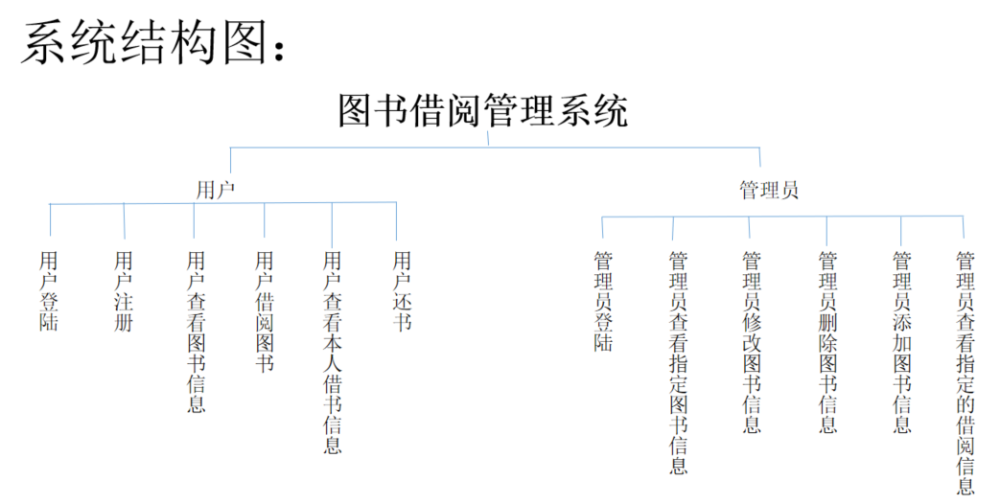

# 图书管理系统

此项目是一个[cms(内容管理系统)](https://baike.baidu.com/item/CMS/315935?fr=aladdin)JAVASE项目;

### 使用语言：java

### 配置环境：jdk 1.8

### 开发工具：eclipse

### 模块划分

#### 用户前台模块部分：
```
1. 注册信息
2. 用户登陆
3. 查看所有图书信息
4. 查看热门图书信息
5. 查看可借图书信息
6. 查看已借图书信息(不可借)
7. 查看本人所有借书记录
8. 查看本人未归还图书记录
9. 查看本人已归还图书记录(已还借书记录)
10. 借书
11. 还书
```
#### 管理员后台模块部分：
```
1. 用户登陆
2. 查看所有图书信息 ----未完成 样式完成
3. 查看指定编号的图书信息----未完成 样式完成
4. 查看指定书名的图书信息----未完成 样式完成
5. 添加图书----未完成 样式完成
6. 删除图书----未完成 样式完成
7. 修改图书----未完成 样式完成
8. 查看指定用户的借书历史记录----未完成 样式完成
9. 查看指定图书的借出历史记录----未完成  样式完成
```


### 总体架构：
```
MVC设计模式：
1.View视图层：各个Frame，有登陆窗体，注册窗体，查询图书信息窗体，查询借书信息窗体
2.Controller层：Listener
3.Model层：Service
4.数据访问层：Dao
```


### 技术选型：
```
数据库：Oralce11G
JDBC工具：DBUtils
层与层之间解耦合：工厂设计模式
数据展示控件：JTable
访问数据库的查询方法封装使用技术：泛型，反射机制
```
### 数据库设计

#### libary_tab_Book表

|  列名	  |  数据类型	|  可否为空	 |  说明  |
| ------  | ---------- | --------- | ------ |
|book_id	|int	|not null	|书籍编号，自增长|
|book_name	|varchar	|not null	|书籍名称|
|book_count	|int	|not null	|借出次数|
|book_status	|int	|not null	|书籍状态（0，已借出，1，可借）|

#### libary_tab_Users表
|  列名	 |  数据类型  |  可否为空  |  说明  |
| ------ | -------- | --------- | ------ |
|user_id |	int|	not null|	用户编号，自增长|
|user_name|	varchar|	not null|	用户名，唯一|
|user_password|	varchar	|not null|	用户密码|
|user_type	|int|	not null|	用户类型，1，普通用户，2，管理员|

### libary_tab_Record表

|  列名	|  数据类型  |  可否为空  |	 说明  |
| -----  | --------- | --------- | ------ |
| record_id	| int | not null	| 记录编号，自增长|
| user_id	| int | not null	| 借书人的编号，外键|
| book_id	| int  | not null	| 书籍编号，外键|
| lend_time	| date | not null	| 借出时间|
|return_time | date || 归还时间 |


### 项目coding bug总结：

1. 数据库列名与代码中列名不一致 报标识符无效


2. switch 里少写一种条件 无法得到数据


3. insert into tab_record(record_id,book_id,user_id,lend_time) values(seq_record_id.nextval,?,?,sysdate)语句少最后一个“）”号


4. select seq_record_id.nextval from dual; 值被占用。。
解决方法 在pl/sql工具中多执行几次直到大于当前表的索引值


5. JInternalFrame窗体无法关闭 原因：this.setDefaultCloseOperation()里参数DISPOSE_ON_CLOSE/EXIT_ON_CLOSE混淆 正确值应该是 DISPOSE_ON_CLOSE


6. sql语句后面多写分号 例："insert into tab_user(user_id,user_name,user_password,user_type)"
			+ " values((select max(user_id) from tab_user)+1,?,?,?);" 正确写法应该是:"insert into tab_user(user_id,user_name,user_password,user_type)"
			+ " values((select max(user_id) from tab_user)+1,?,?,?)"
			


